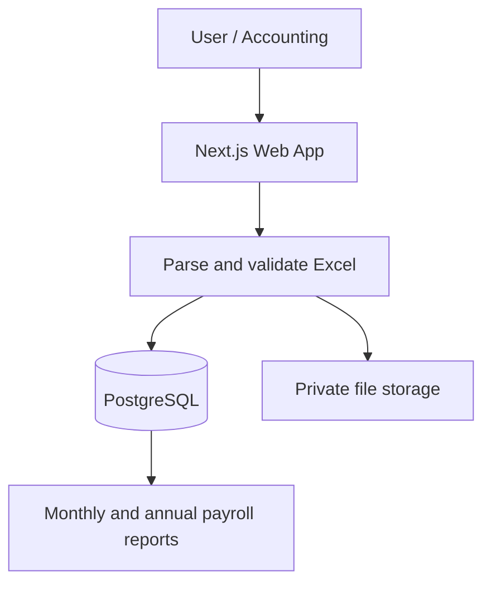

# NTP Audit

Internal payroll platform for importing monthly Excel files, managing employee payroll data, and generating annual reports automatically.

<p>
  
  
  
  
  
</p>

## Features

- Monthly Excel payroll import
- Employee payroll management
- Monthly and annual payroll reports
- Leave and salary adjustment tracking
- Original Excel file storage
- Employee annual payroll tables
- Historical payroll data by year

## Tech Stack

**Current**

- Next.js, TypeScript, and project CSS/design tokens
- PostgreSQL with an optional Supabase PostgreSQL target and private Supabase Storage for original Excel workbooks
- Docker and npm for local development

**Future plan**

- Tailwind CSS if the team decides to migrate the current CSS system

## Workflow



## Run locally

```bash
npm install
docker compose up -d
cp .env.example .env.local
# Set ADMIN_EMAIL, ADMIN_PASSWORD, and a random SESSION_SECRET in .env.local
npm run db:setup
npm run dev
```


