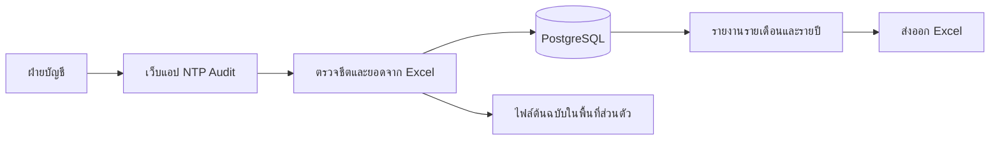

# NTP Audit

ระบบภายในสำหรับข้อมูลเงินเดือนพนักงาน นำเข้า Excel รายเดือน และรายงานรายปี

## การไหลของข้อมูล



## เริ่มใช้งานในเครื่อง

```bash
npm install
docker compose up -d
cp .env.example .env.local
# ใส่ ADMIN_EMAIL, ADMIN_PASSWORD และเปลี่ยน SESSION_SECRET ใน .env.local
npm run db:setup
npm run dev
```

บน Windows PowerShell ใช้ `Copy-Item .env.example .env.local` แทน `cp` ได้ เปิด `http://localhost:3000/login` แล้วเข้าสู่ระบบด้วยบัญชีที่ตั้งใน `.env.local` หลังสร้างบัญชีแล้วสามารถลบ `ADMIN_PASSWORD` จากไฟล์นั้นได้

ระบบใช้ PostgreSQL ใน Docker ที่พอร์ต `127.0.0.1:5433` สำหรับพัฒนา หากใช้ Supabase ภายหลัง ให้เปลี่ยน `DATABASE_URL` เป็น PostgreSQL connection string ของโปรเจกต์ แล้วรัน `npm run db:setup` อีกครั้ง เก็บ `.env.local` ไว้เฉพาะเครื่องหรือ secret manager

## โครงสร้าง

- `src/app` — Next.js routes และระบบภาพ
- `src/components/workspace.tsx` — หน้าจอและการไหลของงาน
- `src/lib/data-context.tsx` — โหลดข้อมูลจริงจาก API และแปลงยอดรายเดือนเป็นข้อมูลหน้าจอ
- `db/schema.sql` — โครง PostgreSQL และ active import view
- `scripts/setup.mjs` — สร้างตาราง รายการเงินเดือนเริ่มต้น และบัญชี Admin
- `docs/product-plan.md` — แผน session, ระบบข้อมูล และเกณฑ์ตรวจ

ไฟล์ `.xlsx` และ `.env*` ถูกกันออกจาก Git เพื่อป้องกันการเผยแพร่ข้อมูลส่วนบุคคลและคีย์เชื่อมต่อ

## สถานะงาน

Session 1: หน้าจอ 17 เส้นทางและระบบภาพ

Session 2: PostgreSQL, Login แบบ session cookie, บทบาท, API ข้อมูลจริง, เพิ่มพนักงาน/วันลา/ปรับเงินเดือน และ audit log

Session 3: Excel importer ใช้งานจริง เลือกชีต ตรวจยอด จับคู่พนักงาน/รายการใหม่ บันทึกแบบ transaction เก็บเวอร์ชันและไฟล์ต้นฉบับส่วนตัว

Session 4: รายงานรายปีแสดงรายการเงินได้/หักจากฐานข้อมูลทุกประเภทและเว้นช่องเดือนที่ยังไม่มีข้อมูล ส่งออก Excel 3 แบบ ดูต้นทางของรายการ แก้ไขยอดพร้อมเก็บยอดจากไฟล์และ audit log และติดตั้งเป็น PWA ได้

## นำเข้าไฟล์รายเดือน

เข้าสู่ระบบด้วยบทบาท `admin` หรือ `payroll` แล้วไปที่ **นำเข้าข้อมูล** เลือกไฟล์ `.xlsx` รายเดือน ตรวจชีตและงวดที่ระบบเสนอ จับคู่พนักงานและหัวรายการที่ไม่รู้จัก ตรวจยอดก่อนกดยืนยัน หากงวดซ้ำ ให้เลือกแทนที่เพื่อเก็บเวอร์ชันก่อนหน้าไว้ รายการที่ยอดรวมต่างจาก Excel จะไม่อนุญาตให้บันทึก

ไฟล์ตัวอย่าง `เดือน 9.xlsx` จะเสนอชีต `คิดค่าจ้าง` เป็นค่าเริ่มต้นตามที่ยืนยันไว้ ระบบอ่านเฉพาะชีตที่ผู้ใช้เลือก ไม่ดึงทุกชีตเข้าเป็นงวดเงินเดือน ไฟล์ต้นฉบับถูกเก็บใน `.data/uploads` ซึ่งอยู่นอก Git; ควรสำรองทั้งฐานข้อมูลและโฟลเดอร์นี้พร้อมกัน

## รายงานและแก้ไข

หน้า **ข้อมูลรายเดือน** เปิดรายละเอียดพนักงานแต่ละคนเพื่อดูรายการรายได้/หักและไฟล์ ชีต แถว เซลล์ต้นทางได้ บทบาท `admin` และ `payroll` แก้ยอดพร้อมระบุเหตุผลได้ ระบบคงยอดเดิมจาก Excel และบันทึก audit log จากนั้นคำนวณยอดงวดและรายงานใหม่ทันที

หน้า **รายงานรายปี** แสดงรายการเงินได้และหักทุกชนิดที่มีในฐานข้อมูล ไม่จำกัดเฉพาะเงินเดือน/OT/ภาษี เดือนที่ยังไม่มีข้อมูลแสดง `—` ปุ่มส่งออก Excel อยู่ในหน้ารายคน รายเดือน และสรุปบริษัท รายคนมีชีตวันลาและประวัติปรับเงินเดือนเพิ่มด้วย

## ตั้งค่า Supabase ภายหลัง

ดู [คู่มือตั้งค่า Supabase](docs/setup-supabase.md) สำหรับการสร้างโปรเจกต์และเชื่อม PostgreSQL โค้ดปัจจุบันใช้งานกับ PostgreSQL ใน Docker ได้ทันทีโดยไม่ต้องมี Supabase ก่อน

## ติดตั้งบน Windows

เปิดแอปผ่าน HTTPS หรือ `localhost` ด้วย Microsoft Edge/Chrome แล้วเลือก **ติดตั้งแอป** จากเมนูเบราว์เซอร์ แอปจะเปิดในหน้าต่างแยก ข้อมูลเงินเดือนต้องเชื่อมต่อเซิร์ฟเวอร์เสมอ; โหมดออฟไลน์แสดงเพียงข้อความแจ้งให้เชื่อมต่อใหม่เพื่อไม่เก็บข้อมูลเงินเดือนใน cache
