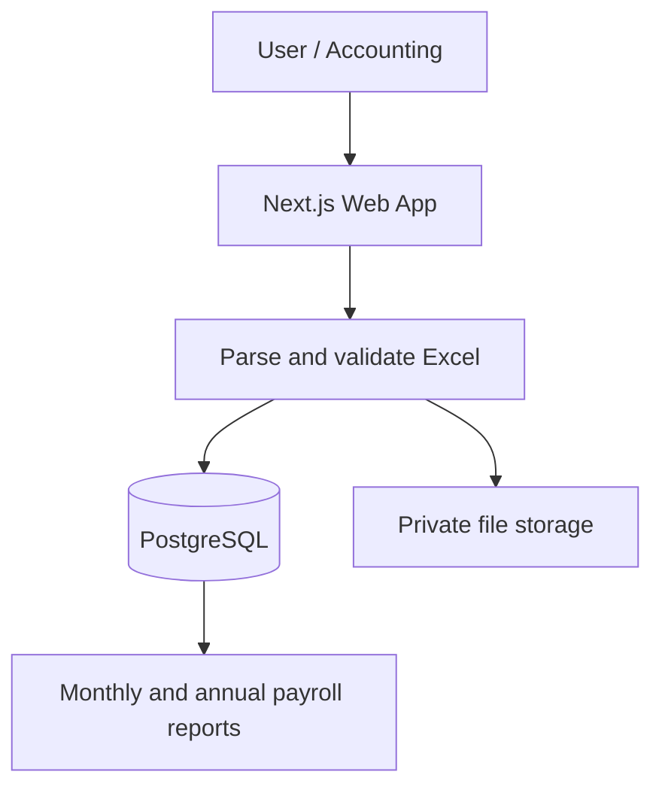

# NTP Audit

Internal payroll platform for importing monthly Excel files, managing employee payroll data, and generating annual reports automatically.

<p>
  
  
  
  
  
</p>

## Features

- Monthly Excel payroll import
- Employee payroll management
- Monthly and annual payroll reports
- Leave and salary adjustment tracking
- Original Excel file storage
- Employee annual payroll tables
- Historical payroll data by year

## Tech Stack

**Current**

- Next.js, TypeScript, and project CSS/design tokens
- PostgreSQL with an optional Supabase PostgreSQL target and private Supabase Storage for original Excel workbooks
- Docker and npm for local development

**Future plan**

- Tailwind CSS if the team decides to migrate the current CSS system

## Workflow



## Run locally

```bash
npm install
docker compose up -d
cp .env.example .env.local
# Set ADMIN_EMAIL, ADMIN_PASSWORD, and a random SESSION_SECRET in .env.local
npm run db:setup
npm run dev
```

On Windows PowerShell, use `Copy-Item .env.example .env.local` instead of `cp`. Open `http://localhost:3000/login`. The `.env.local` file and original Excel files are excluded from Git.

The sample `เดือน 9.xlsx` defaults to the `คิดค่าจ้าง` worksheet; confirm the sheet and payroll period before saving. Duplicate imports require an explicit replacement and retain the previous version. Annual employee reports include every stored income and deduction type, leave, and salary adjustments. Monthly downloads always return the original workbook from the active import.

See [Supabase setup](docs/setup-supabase.md) for connecting a project and migrating existing data, and [product plan](docs/product-plan.md) for the session scope and validation results.

Admin can create, deactivate, and reset user accounts in **Settings**. Payroll users can import and edit payroll data; viewers can read dashboards and reports. Settings also show saved Excel mappings and company details. The app can be installed in Edge or Chrome as a PWA over HTTPS or localhost; payroll data is never cached for offline use.
